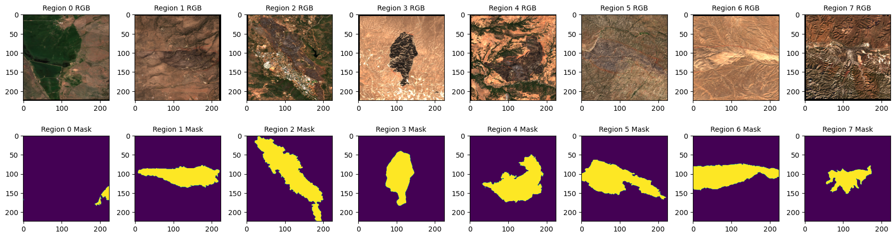

# Wildfire Detection by Fine-Tuning Remote Sensing Foundation Models

This project fine-tunes models pre-trained on remote sensing data to perform wildfire area segmentation.

## Description

This repository contains code for retrieving satellite imagery, preprocessing data, and fine-tuning foundation models for burned area detection.

* Data Examples: A small example dataset (20 samples) is provided to run through the notebooks and train models for a few epochs.


* Data Acquisition: The retrieval process for the [California Fire Perimeter Dataset](https://gis.data.ca.gov/datasets/CALFIRE-Forestry::california-fire-perimeters-all/explore?location=37.187645%2C-120.227660%2C5.95) and [Harmonized Sentinel-2 MSI: MultiSpectral Instrument, Level-2A (SR)](https://developers.google.com/earth-engine/datasets/catalog/COPERNICUS_S2_SR_HARMONIZED#description) is documented in [here](docs/data_acquisition.md).

* Notebooks: The provided Jupyter notebooks offer detailed explanations and code for:

- Retrieving data from GeoJSON and satellite imagery.

- Data preprocessing (cloud masking, band selection).

- Dataset preparation for deep learning.

- Model training and evaluation.

* Training: Models were trained on GPU. The complete training scripts are located in the scripts folder. We fine-tuned models on both RGB and multi-spectral images for 30 epochs. Training logs are available in the logs folder.


## Getting Started

### Installation
#### 1. Clone the Repository

```
git clone https://github.com/Runan-Duan/Wildfire_Detection.git
```
#### 2. Set Up the Python Environment
All required dependencies are listed in the environment.yml file. Create the Conda environment using:
```
conda env create -f environment.yml
conda activate wildfire-detection 
```

### Execution

To train a model on RGB images using the SwinB_RGB architecture:
```
python train.py --batch_size 16 --epochs 30  --num_data 400 --model "SwinB_RGB" 
```
To train a model on multi-spectral images using the SwinB_MS architecture:

```
python train.py --batch_size 16 --epochs 30  --num_data 400 --model "SwinB_MS" --multispectral
```

## Authors

Runan, Duan [runan.duan@stud.uni-heidelberg.de](runan.duan@stud.uni-heidelberg.de)
Sam, Olinger [S.Olinger@stud.uni-heidelberg.de](S.Olinger@stud.uni-heidelberg.de)

## Acknowledgements
This project was inspired by the lecture "[Geographic Applications of Machine Learning](https://giscience.courses-pages.gistools.geog.uni-heidelberg.de/geographic-applications-of-machine-learning/content/intro.html)" at the Geographical Institute of the University of Heidelberg.